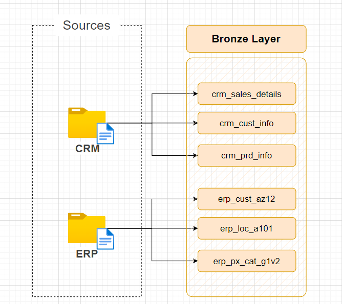
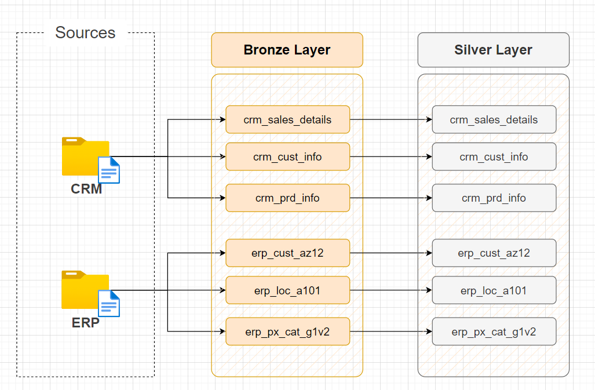

# 📊 Project Title: Modern Data Warehouse & Analytics

## Overview

This project addresses the challenge of transforming raw business data from multiple sources (ERP and CRM systems) into actionable business insights through a modern data warehouse solution. It provides a scalable, efficient, and analytics-ready architecture, integrating robust ETL pipelines, data modeling (Star Schema), Exploratory Data Analysis (EDA), and comprehensive SQL-based reporting.

---

## 📁 Project Structure

```
Modern-Data-Warehouse-Analytics-End-to-End-Project/
│
├── automation/                         # [Automation scripts and setup](automation/README.md)
│
├── datasets/                           # [Datasets and details](datasets/README.md)
│
├── docs/                               # [Comprehensive documentation](docs/README.md)
│   ├── bronze/                         # [Bronze layer documentation](docs/bronze/README.md)
│   ├── silver/                         # [Silver layer documentation](docs/silver/README.md)
│   ├── gold/                           # [Gold layer documentation](docs/gold/README.md)
│   ├── warehouse/                      # [Warehouse overall documentation](docs/warehouse/README.md)
│   └── my_notes/                       # Additional project diagrams and notes
│
├── logs/                               # ETL execution logs
│
├── scripts/                            # [ETL and transformation scripts](scripts/README.md)
│   ├── bronze/
│   ├── silver/
│   ├── gold/
│   ├── config_paths.sql
│   ├── init_database.sql
│   └── setup_config.sql
│
├── tests/                              # [Quality control tests](tests/README.md)
│
├── report/                             # [Analysis and reporting scripts](report/README.md)
│   ├── 1_gold_layer_datasets/
│   ├── 2_eda_scripts/
│   └── 3_advanced_eda/
│
├── CONFIG_README.md                    # [Configuration system overview](CONFIG_README.md)
├── LICENSE                             # License information
├── README.md                           # Project overview and instructions (this file)
├── requirements.txt                    # Python dependencies
└── config.sql                          # SQL configuration settings
```


---

## 🗃️ Dataset Structure

This source file contains two directories: one from the CRM source and another from the ERP source.

```
dataset/
├── source_crm
│   ├── cust_info.csv             # Customer information table         
│   ├── prd_info.csv              # Product information table
│   ├── sales_details.csv         # Sales information table
└── source_erp
    ├── cust_az12.csv             # Customer extra information table
    ├── erp_loc_a101.csv          # Location information table 
    ├── erp_px_cat_g1v2.csv       # Product category information table
```
---


### 🔹 CRM (Customer Relationship Management)

**Purpose**  
CRM systems are designed to help businesses effectively manage interactions with customers, leads, and sales prospects.

**Core Focus**  
- Enhancing customer relationships  
- Managing sales pipelines  
- Tracking communications (e.g., calls, emails, meetings)  
- Automating marketing and support workflows  

**Popular CRM Platforms**  
- Salesforce  
- HubSpot  
- Zoho CRM  
- Microsoft Dynamics 365 (CRM module)  

**Example Use Case**  
A sales representative uses a CRM system to track leads, schedule follow-up calls, and access a customer's complete interaction history. This enables them to personalize their pitch and improve the chances of closing a deal.


### 🔹 ERP (Enterprise Resource Planning)

**Purpose**  
ERP systems integrate core business processes like finance, HR, manufacturing, supply chain, and inventory management into one unified system.

**Core Focus**  
- Streamlining internal operations  
- Improving data flow between departments  
- Centralized management of business resources  
- Reducing operational costs  

**Popular ERP Platforms**  
- SAP  
- Oracle NetSuite  
- Microsoft Dynamics 365 (ERP module)  
- Odoo  

**Example Use Case**  
A manufacturing company uses an ERP system to manage inventory levels, plan production, process payroll, and track expenses—all from one platform.

## 🗄️ Tables

### ➡️ 1. Customer Information (`Customer Info`)

This table stores core information about customers.

| Column Name        | Data Type     | Description                                     |
|-------------------|---------------|-------------------------------------------------|
| `cst_id`          | INT (Primary Key)| Unique identifier for each customer.           |
| `cst_key`         | VARCHAR(255) | Unique key for the customer (e.g., UUID).       |
| `cst_firstname`   | VARCHAR(255) | Customer's first name.                         |
| `cst_lastname`    | VARCHAR(255) | Customer's last name.                          |
| `cst_marital_status`| VARCHAR(50)  | Customer's marital status (e.g., Single, Married).|
| `cst_gndr`        | VARCHAR(10)  | Customer's gender.                             |
| `cst_create_date` | DATETIME     | Date and time when the customer record was created.|

### ➡️ 2. Product Information (`Product Info`)

This table stores details about the products offered.

| Column Name   | Data Type     | Description                                     |
|---------------|---------------|-------------------------------------------------|
| `prd_id`      | INT (Primary Key)| Unique identifier for each product.           |
| `prd_key`     | VARCHAR(255) | Unique key for the product (e.g., UUID).       |
| `prd_nm`      | VARCHAR(255) | Name of the product.                           |
| `prd_cost`    | INT       | Cost of the product.                            |
| `prd_line`    | VARCHAR(255) | Product line or category.                       |
| `prd_start_dt`| DATE         | Date when the product became available.         |
| `prd_end_dt`  | DATE         | Date when the product became unavailable (if applicable).|

### ➡️ 3. Sales Details (`Sales details`)

This table records individual sales transactions.

| Column Name   | Data Type     | Description                                     |
|---------------|---------------|-------------------------------------------------|
| `sls_ord_num` | INT (Primary Key)| Unique identifier for each sales order.       |
| `sls_prd_key` | VARCHAR(255) | Foreign Key referencing `Product Info` table.   |
| `sls_cust_id` | INT         | Foreign Key referencing `Customer Info` table.  |
| `sls_order_dt`| DATE         | Date of the sales order.                        |
| `sls_ship_dt` | DATE         | Date when the order was shipped.                |
| `sls_due_dt`  | DATE         | Due date for the order.                         |
| `sls_sales`   | INT       | Total sales amount for the order.               |
| `sls_quantity`| INT         | Quantity of products sold in the order.         |
| `sls_price`   | INT       | Price per unit of the product at the time of sale.|

### ➡️ 4. Customer Extra Details (`Customer extra details`)

This table stores additional customer details.

| Column Name | Data Type     | Description                                     |
|-------------|---------------|-------------------------------------------------|
| `CID`       | INT (Primary Key)| Foreign Key referencing `Customer Info` table.  |
| `BDATE`     | DATE         | Customer's birth date.                          |
| `GEN`       | VARCHAR(10)  | Customer's gender (can be redundant with `cst_gndr`).|

### ➡️ 5. Location (`Location Tables`)

This table stores customer location information.

| Column Name | Data Type     | Description                                     |
|-------------|---------------|-------------------------------------------------|
| `CID`       | INT (Primary Key)| Foreign Key referencing `Customer Info` table.  |
| `CNTRY`     | VARCHAR(255) | Customer's country.                             |

### ➡️ 6. Category (`Category Table`)

This table categorizes products.

| Column Name | Data Type     | Description                                     |
|-------------|---------------|-------------------------------------------------|
| `ID`        | INT (Primary Key)| Unique identifier for each category.           |
| `CAT`       | VARCHAR(255) | Main category name.                            |
| `SUBCAT`    | VARCHAR(255) | Subcategory name.                               |
| `MAINTENANCE`| VARCHAR(255) | Maintenance information or notes about the category. |

---

##🪴  Relationships

🔹 `Sales Details` has a foreign key `sls_prd_key` referencing `Product Info` (one-to-many).

🔹   `Sales Details` has a foreign key `sls_cust_id` referencing `Customer Info` (one-to-many).

🔹  `Customer Extra Details` has a foreign key `CID` referencing `Customer Info` (one-to-one).

🔹  `Location` has a foreign key `CID` referencing `Customer Info` (one-to-one).

## 📟 Notes

🔹  Consider using UUIDs for `cst_key` and `prd_key` for better scalability and distributed systems.

🔹   The `GEN` column in `Customer Extra Details` might be redundant if `cst_gndr` in `Customer Info` is already present.  Consider removing the redundant column.
  
🔹  Data types should be chosen appropriately based on the expected data and database system being used.


---

## 🔧 Setup and Installation Instructions

### 0. Transfer the Project Folder to Server
use `scp -i ~/.ssh/id_rsa -r path-to-this-project-folder your-username@server-ip:~` to transfer the project folder from your local computer to server

**Note:** While you can also run this project on your computer, it is highly discouraged. Here are the reasons:
* A real-world project like this one, always lives on a server. As a data scientist you need to practice server aspects as well. 
* We have tested the project on the server and you will encounter less issues there. On the other hand, running this project on your computer will result in issues unique to your local computer and debugging can be cumbersome.

### 1. Install Prerequisites
If you want to run on you local machine then you need to install
[PostgreSQL](https://www.postgresql.org/download/)


If you are working on the server (suggested) first ask the admin to create a role for you by running the following SQL command:

``` bash
sudo -i -u postgres
psql
CREATE ROLE <your username here> WITH LOGIN CREATEDB;
\q
```

Next, create a database for yourself 
```bash
createdb <your username here>
```


## 🛠️ Step-by-Step Guide

### 1. Initialize Database
* Script Purpose:
    This script creates a new database named 'database_name' after checking if it already exists.
    First, it terminates active connections if the database is active, then it is dropped and recreated.
    Additionally, the script sets up three schemas within the database: 'bronze', 'silver', and 'gold'.


* WARNING:
    Running this script will drop the entire 'datawarehouse' database if it exists.
    All data in the database will be permanently deleted. Proceed with caution
    and ensure you have proper backups before running this script.


Note: change `my_new_database_name` to a name unique to yourself.

```bash

export database_name="my_new_database_name"

find ~/Modern-Data-Warehouse-Analytics-End-to-End-Project -type f -exec sed -i "s/datawarehouse/$database_name/gI" {} +

psql -f scripts/init_database.sql
```


### 2. Configure Paths

* Script Purpose:
    This script creates a configuration table to store path variables for the ETL process.
    It provides a centralized location for managing file paths that can be easily updated.

``` bash
psql ${database_name} -f scripts/config_paths.sql
```

### 3. Load Data into Bronze Layer

* Script Purpose:
    This script creates tables in the 'bronze' schema, dropping existing tables 
    if they already exist.
	  Run this script to re-define the DDL structure of 'bronze' Tables
``` bash
psql ${database_name} -f scripts/bronze/ddl_bronze.sql
```

* Script Purpose:
    This stored procedure loads data into the 'Bronze' schema from external CSV files.
    It performs the following actions:
    - Retrieves path configurations from the config.file_paths table
    - Truncates the bronze tables before loading data
    - Uses the 'COPY' command to load data from CSV files to bronze tables
    - Calculates and logs the time taken for each table load
    - Calculates and logs the total batch processing time

* Prerequisites:
    Before calling this procedure, you must:
    1. Run the config_paths.sql script to create and populate the config.file_paths table

```bash
psql ${database_name} -f scripts/bronze/proc_load_bronze.sql
```
* Call the procedure to load data into the bronze layer:
```bash
psql ${database_name} -c "CALL bronze.load_bronze();"
```
* Note: The procedure will need admin privileges to run successfully. If you encounter permission issues, please run this workaround file

This script automates the loading of raw source data from CSV files into the Bronze layer of the data warehouse. It performs the following actions:
Truncates existing records in Bronze tables to ensure clean reloading.
Load CRM-related datasets from datasets/source_crm/
Load ERP-related datasets from datasets/source_erp/
Ensures the Bronze layer reflects the most recent raw data extracts.
Is designed for non-superuser environments (e.g., local development) where COPY is not permitted.
This script serves as the entry point for the ETL pipeline, transforming raw CSVs into structured relational tables, ready for cleansing and transformation in the Silver layer.
```bash
psql ${database_name} -f scripts/bronze/load_bronze_client.sql
```

### 4. Transform Data into Silver Layer



* Script Purpose:
    This script creates tables in the 'silver' schema, dropping existing tables 
    if they already exist.
	  Run this script to re-define the DDL structure of 'silver' Tables
``` bash
psql ${database_name} -f scripts/silver/ddl_silver.sql
``` 

* Script Purpose:
    This stored procedure peroforms the ETL(Extract, Transform, Load) process to 
    Populate the  'silver' schema tables from the 'bronze' schema.

    It performs the following actions:
    - Truncates the silver tables before loading data.
    - Insert the clean and transformed date from Bronze into Silver Tables.

```bash
psql ${database_name} -f scripts/silver/proc_load_silver.sql
```
* Call the procedure to load data into the silver layer:
```bash
psql ${database_name} -c "CALL silver.load_silver();"
```

### 5. Transform Data into Gold Layer
* Script Purpose:
    This script creates views for the Gold layer in the data warehouse. 
    The Gold layer represents the final dimension and fact tables (Star Schema)

    Each view performs transformations and combines data from the Silver layer 
    to produce a clean, enriched, and business-ready dataset.
``` bash
psql ${database_name} -f scripts/gold/ddl_gold.sql
```

### 6. Run EDA Scripts


* Script Purpose:
    This script creates a new database named '${database_name}Analytics' if it doesn't already exist.
    It then creates three schemas within the database: 'bronze', 'silver', and 'gold'.

* WARNING:
    Running this script might require you to manually drop the database if it exists due to PostgreSQL's 
    handling of concurrent connections.  It's best practice to connect to a different database (e.g., 'postgres')
    to drop '${database_name}Analytics' if it exists.

``` bash
psql -f report/2_eda_scripts/00_init_database.sql
```

* Script Purpose:
    - To explore the structure of the database, including the list of tables and their schemas.
* Table Used:
    - INFORMATION_SCHEMA.TABLES
    - INFORMATION_SCHEMA.COLUMNS
    - To inspect the columns and metadata for specific tables.

``` bash 
psql ${database_name}Analytics -f report/2_eda_scripts/01_database_exploration.sql
```

* Script Purpose:
    - To explore the structure of dimension tables.

SQL Functions Used:
    - DISTINCT
    - ORDER BY

Note: press `q` to quit the view. 
```bash
psql ${database_name}Analytics -f report/2_eda_scripts/02_dimensions_exploration.sql
```

* Script Purpose:
    - To determine the temporal boundaries of key data points.
    - To understand the range of historical data.

SQL Functions Used:
    - MIN(), MAX(), EXTRACT(), AGE()

```bash
psql ${database_name}Analytics -f report/2_eda_scripts/03_date_range_exploration.sql
```

*Script Purpose:
    - To calculate aggregated metrics (e.g., totals, averages) for quick insights.
    - To identify overall trends or spot anomalies.

SQL Functions Used:
    - COUNT(), SUM(), AVG(), DISTINCT()

```bash 
psql ${database_name}Analytics -f report/2_eda_scripts/04_measures_exploration.sql
```
Script Purpose:
    - To quantify data and group results by specific dimensions.
    - For understanding data distribution across categories.

SQL Functions Used:
    - Aggregate Functions: SUM(), COUNT(), AVG()
    - GROUP BY, ORDER BY
```bash
psql ${database_name}Analytics -f report/2_eda_scripts/05_magnitude_analysis.sql
```
* Script Purpose:
    - To rank items (e.g., products, customers) based on performance or other metrics.
    - To identify top performers or laggards.

SQL Functions Used:
    - Window Ranking Functions: RANK(), DENSE_RANK(), ROW_NUMBER()
    - Clauses: GROUP BY, ORDER BY, LIMIT
```bash
psql ${database_name}Analytics -f report/2_eda_scripts/06_ranking_analysis.sql
```


### 7 Run Advanced EDA Scripts
* Script Purpose:
    - To track trends, growth, and changes in key metrics over time.
    - For time-series analysis and identifying seasonality.
    - To measure growth or decline over specific periods.

SQL Functions Used:
    - Date/Time Functions: EXTRACT(), DATE_TRUNC(), TO_CHAR()
    - Aggregate Functions: SUM(), COUNT(), AVG()
```bash
psql ${database_name}Analytics -f report/3_advanced_eda/07_change_over_time_analysis.sql
```
* Script Purpose:
    - To calculate running totals or moving averages for key metrics.
    - To track performance over time cumulatively.
    - Useful for growth analysis or identifying long-term trends.

SQL Functions Used:
    - Window Functions: SUM() OVER(), AVG() OVER()
```bash
psql ${database_name}Analytics -f report/3_advanced_eda/08_cumulative_analysis.sql
```

* Script Purpose:
    - To analyze product sales performance year over year.
    - To compare current year sales to the product's average sales and the 
      previous year's sales.
    - To identify trends and growth patterns.

SQL Functions Used:
    - LAG(): Accesses data from previous rows.
    - AVG() OVER(): Computes average values within partitions.
    - CASE: Defines conditional logic for trend analysis.
```bash
psql ${database_name}Analytics -f report/3_advanced_eda/09_performance_analysis.sql
```
* Script Purpose:
    - To group data into meaningful categories for targeted insights.
    - For customer segmentation, product categorization, or regional analysis.

SQL Functions Used:
    - CASE: Defines custom segmentation logic.
    - GROUP BY: Groups data into segments.

```bash
psql ${database_name}Analytics -f report/3_advanced_eda/10_data_segmentation.sql
```
* Script Purpose:
    - To compare performance or metrics across dimensions or time periods.
    - To evaluate differences between categories.
    - Useful for A/B testing or regional comparisons.

SQL Functions Used:
    - SUM(), AVG(): Aggregates values for comparison.
    - Window Functions: SUM() OVER() for total calculations.
```bash
psql ${database_name}Analytics -f report/3_advanced_eda/11_part_to_whole_analysis.sql
```

### Report from the Gold layer

*Script Purpose:
    - This report consolidates key customer metrics and behaviors.

Highlights:
    1. Gathers essential fields such as names, ages, and transaction details.
    2. Segments customers into categories (VIP, Regular, New) and age groups.
    3. Aggregates customer-level metrics:
        - total orders
        - total sales
        - total quantity purchased
        - total products
        - lifespan (in months)
    4. Calculates valuable KPIs:
        - recency (months since last order)
        - average order value
        - average monthly spend
```bash
psql ${database_name}Analytics -f report/12_report_customers.sql
```
*Script Purpose:
    - This report consolidates key product metrics and behaviors.

Highlights:
    1. Gathers essential fields such as product name, category, subcategory, and cost.
    2. Segments products by revenue to identify High-Performers, Mid-Range, or Low-Performers.
    3. Aggregates product-level metrics:
        - total orders
        - total sales
        - total quantity sold
        - total customers (unique)
        - lifespan (in months)
    4. Calculates valuable KPIs:
        - recency (months since last sale)
        - average order revenue (AOR)
        - average monthly revenue
How to used:
	- SELECT * FROM gold.product_report; 
```bash 
psql ${database_name}Analytics -f report/13_report_products.sql
```

### Step 6: Database Configuration (for deployment)

If you need to deploy, set the path according to CWD:

* Edit `scripts/config_paths.sql` to set paths
* Load datasets into the `/datasets/` folder

---

### Step 7: Prepare for Downstream Analysis Using Python

To perform advanced analytics and visualizations, you can leverage Python's powerful data analysis libraries. Follow the steps below to set up your Python environment and prepare for downstream analysis:

---

#### 1. Install Required Python Libraries

Note: Ensure you have Python3 installed on your system. You can check your Python version by running:
```bash
python3 --version
```
If you don't have Python installed, you can download it from the official website: [Python Downloads](https://www.python.org/downloads/).

Create a virtual environment to manage your Python dependencies:
```bash
python3 -m venv .venv
```
Activate the virtual environment:
```bash
# On Windows
.venv\Scripts\activate
# On macOS/Linux
source .venv/bin/activate
```

Ensure you have Python installed on your system. Then, install the necessary libraries using the `requirements.txt` file provided in the project.

```bash
pip install -r requirements.txt
```
---

---
#### 2. Set Up Database Connection

Note: Please create .env file in root dir as follow and update it according to your database connection details.

```plaintext
DB_NAME=<your-database-name>
DB_USER=<user-dbname>
DB_PASSWORD=<user-name>
DB_HOST=<localhost>
DB_PORT=<5432>
```

---

#### 3. Please run the following python script to connect to the database and fetch data

```bash
python python-script/main.py
```

By following these steps, you can seamlessly integrate Python into your data pipeline for advanced analytics and reporting.

---

## 📖 Additional Documentation

* **[Naming conventions](docs/warehouse/naming_conventions.md)**
* **[Data catalog](docs/gold/data_catalog.md)**
* **[Testing procedures](tests/README.md)**

---

## 📟 Notes

* Utilize UUIDs for scalability
* Remove redundant columns
* Consistent data types for database efficiency
